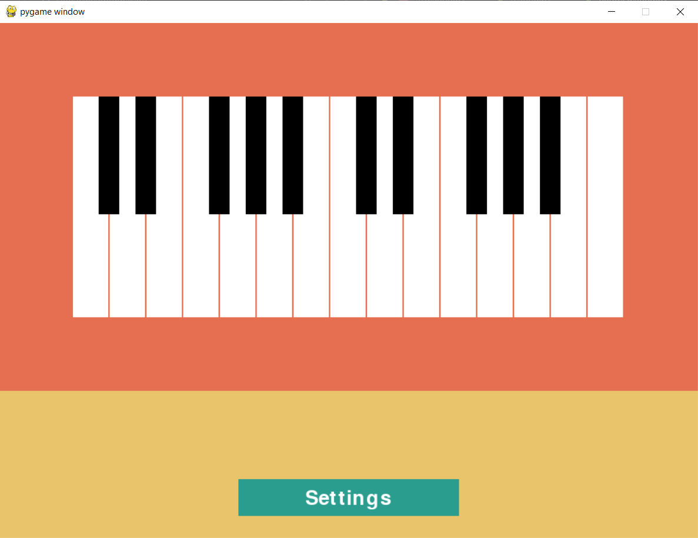

# MusicScalesApp (WIP)
## Plan for App:
Be able to choose a scale and root note which will be highlighted on the keyboard shown with keys numbered
Menu button to open settings window with options to:  
1. Choose Current **_Scale_**
2. Choose Current **_Root note_**
3. Add **_New Scale_** -> input as sequence of numbers between 1-12 separated by commas/spaces  

Scales to be stored in separate text file in plaintext, format to be decided

## Current Version
* Shows keyboard layout
* Highlights key pressed by keyboard 
* Has Menu section and settings button showing but doesn't have any function yet

## _Preview:_

